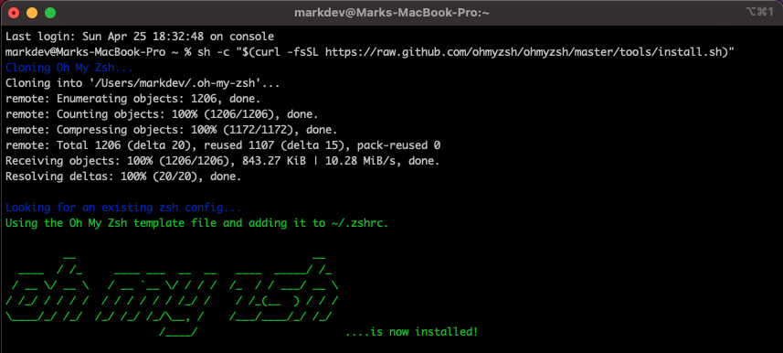
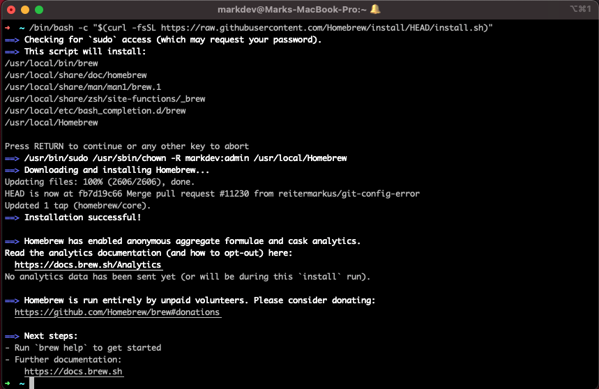
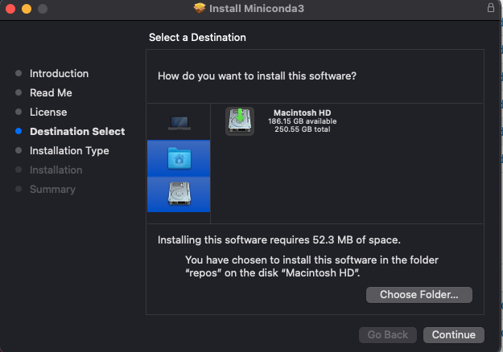
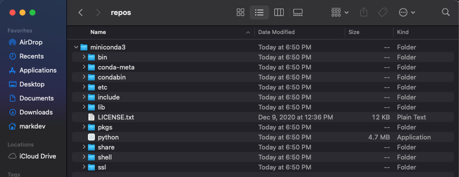

# 🐍 💻 Setting Up a Python Environment on Mac for Data Science
This tutorial will guide you on how to set up a Python environment on your Mac for data science! My goal is to teach you the following skills to get you started on your data science journey:

- Preparing your Mac
- Basic use of the command line
- Downloading Python
- Preparing and IDE and connecting it to Python
- Basic use of GitHub via the command line
- Using .zshrc files
- Bonus: Customizing your terminal and other useful settings

## 🚀 TL;DR
If you are already familiar with setting up Python on Mac or just want to jump straight in:
- Make sure terminal uses zsh (Mac default)
- [Install Oh My Zsh](https://ohmyz.sh/)
- [Install Brew](https://brew.sh/)
- [Install Miniconda](https://docs.conda.io/en/latest/miniconda.html)
- `conda install -c conda-forge jupyterlab`
- Download preferred IDE
- Connect your respective IDE interpreter to Miniconda Python

## 📚 Tutorial
1. Create a folder within your home folder called `repo`.


2. Ensure that your Mac is using zsh for your terminal (this should be the default since macOS 10.15).
   - [Download zsh](http://zsh.sourceforge.net/) if it not your default.

3. [Install iTerm2](https://iterm2.com/), which is a "terminal emulator" that adds some great functionality to your terminal.

4. [Install Xcode](https://developer.apple.com/xcode/), though not required for running Python some packages need it and it's a pain to download in the middle of your work.

5. [Install Oh My Zsh](https://ohmyz.sh/), which is an open source framework that allows you to manage and configure zsh through a .zshrc file (i.e. zsh on ✨steroids✨).



After installing Oh My Zsh, your user home directory should have the following hidden files:


6. [Install Brew](https://brew.sh/), which allows you to download other packages outside of the Python ecosystem, by executing the following line of code in your terminal:
```
/bin/bash -c "$(curl -fsSL https://raw.githubusercontent.com/Homebrew/install/HEAD/install.sh)"
```

This is what my terminal looked like after running the above command.



7. [Install Miniconda](https://docs.conda.io/en/latest/miniconda.html) (MacOSX 64-bit pkg version), which will include "only conda, Python, the packages they depend on, and a small number of other useful packages, including pip, zlib and a few others." Miniconda is a tool manage your Python environments and their respective packages.
   - There are alternatives to Miniconda, such as full Anaconda or downloading Python and managing your environment via venv or pyenv.
   - I believe Miniconda strikes a balance between being beginner friendly while also not being bloated with the extra software and packages found in full Anaconda.
   - If you have a preferred format, then please use that instead and account for it in the rest of this tutorial.

**Ensure that you download Miniconda into your `repos` directory!**



8. Use the following commands in terminal to activate your conda environment, save its path to your `.zshrc` file, and check if it activated properly:
```
source ~/repos/miniconda3/bin/activate
conda init zsh
conda list
```

